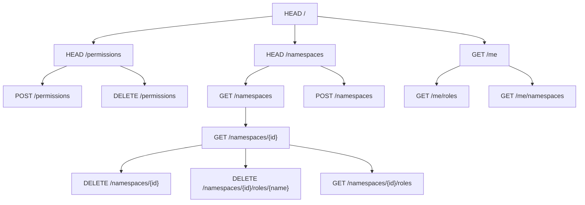

# Guard Server

## Universal rules

- no namespace
- no domain specified

| Actions               | Owner | Manager | Member |
|-----------------------|:-----:|:-------:|:------:|
| List namespaces       |  ✔️   |   ✔️    |   ✔️   |
| List owned namespaces |  ✔️   |   ✔️    |   ✔️   |

## Guard scoped rules
- namespace: `guard`
- no domain specified

| Actions               | Owner | Manager | Member |
|-----------------------|:-----:|:-------:|:------:|
| Add a new namespace   |  ✔️️  |         |        |
| Manage a namespace    |  ✔️   |   ✔️    |        |
| Remove a namespace    |  ✔️   |   ✔️    |        |

## Guard domain scoped rules
- namespace: `guard`
- domain specified

| Actions          | Owner | Manager | Member |
|------------------|:-----:|:-------:|:------:|
| List roles       |  ✔️   |   ✔️    |   ️    |
| Assign role      |  ✔️   |   ✔️    |   ️    |
| Remove role      |  ✔️   |   ✔️    |   ️    |

## Namespace scoped rules

- namespace: not `guard`
- domain optionally specified

| Actions          | Owner | Manager | Member |
|------------------|:-----:|:-------:|:------:|
| List owned roles |  ✔️   |   ✔️    |   ✔️   |

